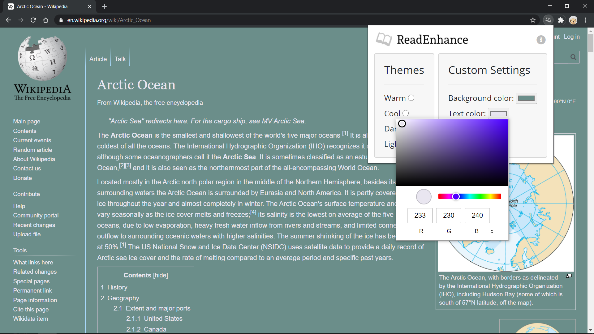
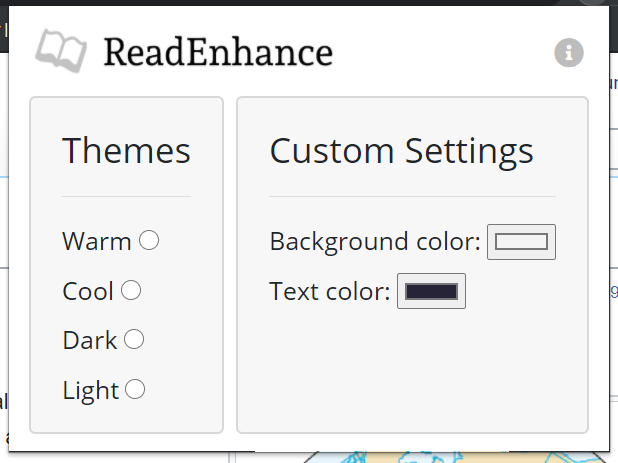

# ReadEnhance

ReadEnhance is a Google Chrome extension that lets users customize background and text colors on a web page.

## Installation

To install the extension, visit the Chrome Web Store and search for "ReadEnhance" or go directly to the extension listing [here](https://chrome.google.com/webstore/detail/readenhance/ejeofcdifeeagihjockeepldligfppda). Click "Add to Chrome". In the pop-up window that appears, click "Add extension" to install. Now you should be able to access the extension from any web page.

## Usage

To use the extension, first select it from the extension toolbar. The main window should now appear:

You can try out the pre-set color themes (warm, cool, dark, light) in the "Themes" section. To adjust the colors manually, click on the color wells in the "Custom Settings" section and drag the circle to your desired color. The corresponding portion of the page will change color as you move the circle around.

To reset any changes, simply refresh the page.

## Support

If you have any issues or want to give feedback, feel free to email me at:  
[timothy.yoon.dev@gmail.com](mailto:timothy.yoon.dev@gmail.com)

## Authors
Timothy Yoon
